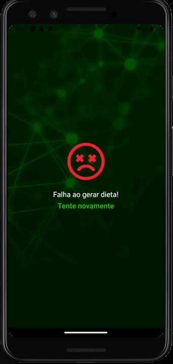

# Dieta AI App

Este projeto é um aplicativo desenvolvido com Node.js e React Native, utilizando TypeScript. O objetivo do aplicativo é gerar dietas com a ajuda da inteligência artificial Gemini.

## Base do Projeto

Este projeto é baseado no perfil do Sujeito Programador [devfraga](https://github.com/devfraga).

## Pré-requisitos

Antes de começar, você precisa ter o Node.js e o npm instalados em sua máquina. Você também precisará de uma chave de API da plataforma [Google AI Studio](https://aistudio.google.com/apikey).

## Clonando o Projeto

Para rodar o projeto na sua máquina, siga os passos abaixo:

```bash
git clone https://github.com/thayannecarrilho/AppDieta.git
```

## Instalando Dependências

### Backend

Navegue até a pasta do backend e instale as dependências:

```bash
cd backend
npm install
```

### Mobile

Navegue até a pasta do mobile e instale as dependências:

```bash
cd mobile
npm install
```

## Configuração da API Key

Na pasta do backend, crie um arquivo `.env` e insira sua chave de API gerada no Google AI Studio:

```bash
API_KEY=SUA_CHAVE
```

## Configurando o IPV4

Na pasta do mobile, você precisará modificar o IPV4. Para fazer isso, abra o `cmd` e execute o seguinte comando:

```bash
ipconfig
```

Anote o endereço IPV4 que será exibido. Em seguida, acesse a pasta `services` na pasta `mobile` e modifique o arquivo `api.ts`:

```typescript
import axios from 'axios';

export const api = axios.create({
    baseURL: "http://seu_ipv4:3333" 
});
```

Substitua `seu_ipv4` pelo endereço IPV4 que você anotou.

## Executando o Projeto

Após as configurações, você pode rodar o backend e o frontend:

### Backend

Navegue até a pasta do backend e inicie o servidor:

```bash
cd backend
npm run dev
```

### Frontend

Navegue até a pasta do mobile e inicie o aplicativo:

```bash
cd mobile
npx expo start
```

## Demonstração


## Design da Interface



## Contribuição

Sinta-se à vontade para contribuir com o projeto! Para relatar problemas ou sugerir melhorias, crie uma nova issue no repositório.


